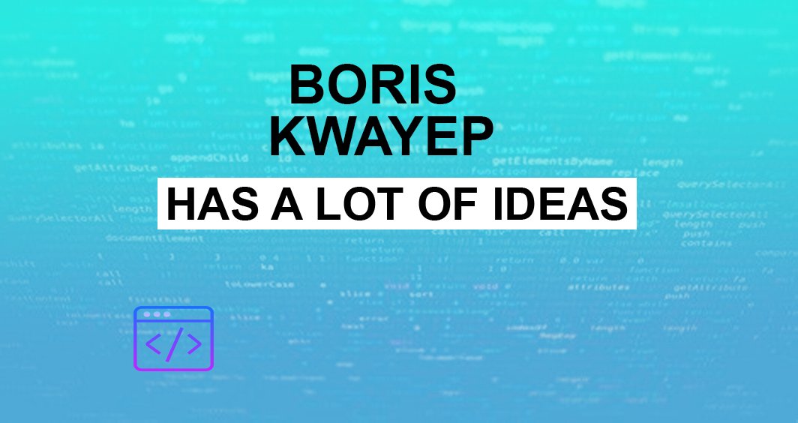

### Welcome to my porfolio 👋
-----------------------------
full stack  developer passionate about system design, user experience and SEO(Search Engine Optimization)
currentling building a full project for blog management

:rocket: FRONT END **HTML,CSS,JAVASCRIPT** **REACT.js, VUE.js**

:notebook: BACKEND **MYSQL** **MONGODB** **NODE** **PHP**

## System design
---------------------
Building architecture systems for company needs ,front-end performance
                    and search engine improvement,creation of systems that are user friendly and focused

## Web accessibility
---------------------
Adding tools and technologies designed to improve the user experience
                    that include Visual, mobility, auditory and cognotive 

## Serveless
---------------------

Focus on  integrate microservice to  web applications in infrastructure such as azure and aws,
                    for  performance, productivity and scalability.
